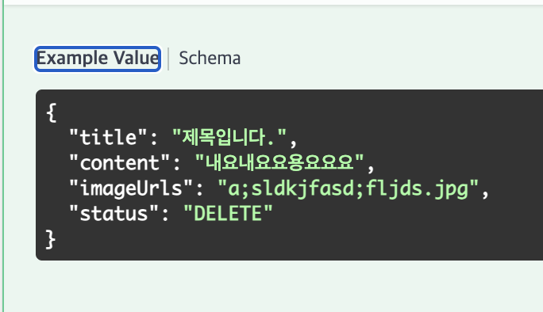
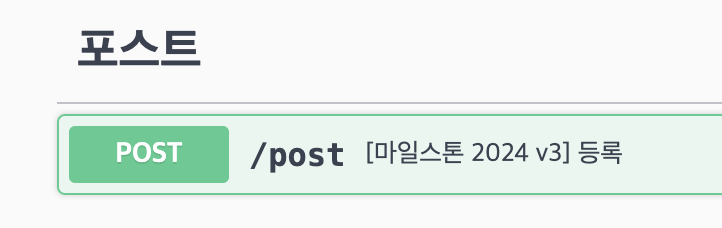
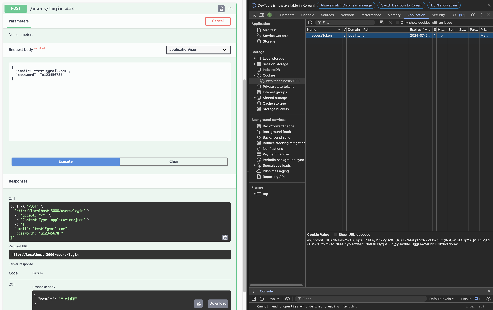
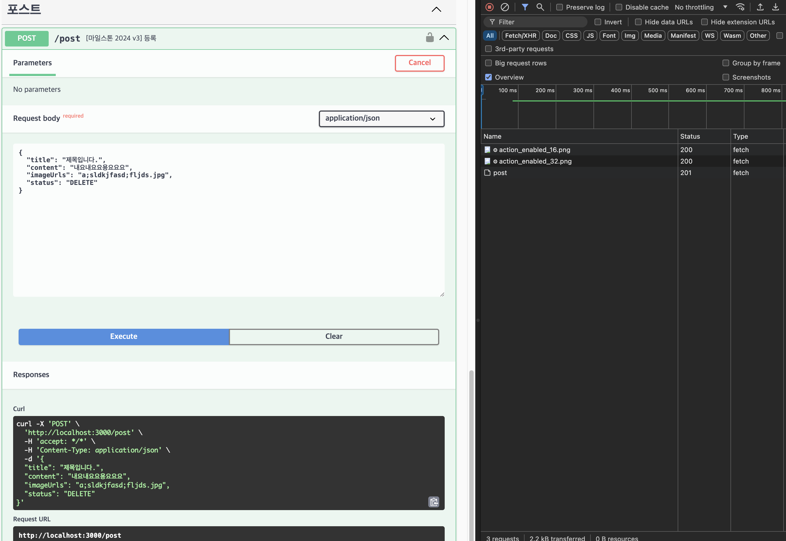

# 개요
이 프로젝트의 목적은 다음과 같습니다.
1. NestJS Plugin - Swagger cli 테스트
2. Jwt + Cookie를 활용한 인증 테스트


## Swagger Cli
1. nest-cli.json 파일에 플러그인 설정을 추가 합니다.
  ```json
      "plugins": [
        {
          "name": "@nestjs/swagger",
          "options": {
            "classValidatorShim": true,
            "introspectComments": true,
            "dtoKeyOfComment": "description",
            "controllerKeyOfComment": "summary",
            "controllerFileNameSuffix": ".controller.ts"
          }
        }
      ]
  ```

2. dto 파일에 다음과 같이 주석을 통해 ApiProperty와 동일한 기능을 추가할 수 있습니다.
```typescript
export class CreatePostDto {
  /**
   * 포스트의 제목 입니다.
   * @example 제목입니다.
   */
  @ApiProperty({
    example: "제목입니다.",
    description: "포스트의 제목 입니다."
  })
  @IsString()
  title: string;

  /**
   * 포스트 내용
   * @example 내요내요요용요요요
   */
  @IsString({ message: '' })
  content?: string;

  /**
   * 이미지 url. 업로드한 후 response 된 url을 입력 합니다.
   * @example a;sldkjfasd;fljds.jpg
   */
  imageUrls?: string;

  /**
   * 상태
   * @example DELETE
   */
  status: PostStatus;
}
```



3. Controller에서 ApiOperation와 동일한 기능을 추가할 수 있습니다.
```typescript
  /**
   * [마일스톤 2024 v3] 등록
   */
  @Post()
  @ApiCreatedResponse({ description: '등록 성공' })
  async create(@Body() dto: CreatePostDto) {
    return undefined;
  }
```


---
## Jwt + Cookie
1. 로그인 API를 요청하면 다음과 같이 쿠키가 생성 됩니다.

2. 쿠키가 생성된 상태에서 인증이 필요한 API를 요청하면 됩니다.

---
### 셋팅 방법
1. cookie-parser 설치
`pnpm i cookie-parser`
`pnpm i -D @types/cookie-parser`

2. cookie-parser를 사용하도록 설정 + swagger에서 쿠키 인증을 사용하도록 설정
```typescript
import { NestFactory } from '@nestjs/core';
import { DocumentBuilder, SwaggerModule } from '@nestjs/swagger';
import * as cookieParser from 'cookie-parser';
import { AppModule } from './app.module';
import { AuthEnum } from './auth/enum/auth.enum';
import { PostModule } from './post/post.module';
import { UsersModule } from './users/users.module';

async function bootstrap() {
  const app = await NestFactory.create(AppModule);

  app.use(cookieParser());

  const config = new DocumentBuilder()
    .setTitle('스웨거')
    .setDescription('The cats API description')
    .setVersion('1.0')
    .addCookieAuth(AuthEnum.ACCESS_TOKEN)
    .build();
....

```

3. jwt strategy
```typescript
import { Injectable } from '@nestjs/common';
import { ConfigService } from '@nestjs/config';
import { PassportStrategy } from '@nestjs/passport';
import { ExtractJwt, Strategy } from 'passport-jwt';
import { UsersService } from '../../users/users.service';
import { AuthEnum } from '../enum/auth.enum';
import { TokenPayload } from '../interfaces/token-payload.interface';

@Injectable()
export class JwtStrategy extends PassportStrategy(Strategy) {
  constructor(
    configService: ConfigService,
    private readonly usersService: UsersService,
  ) {
    super({
      jwtFromRequest: ExtractJwt.fromExtractors([
        (request: any) =>
          request?.cookies?.[AuthEnum.ACCESS_TOKEN] ??
          request?.[AuthEnum.ACCESS_TOKEN], // 첫번째는 http 요청, 두번째는 rpc 요청에 대응
      ]),
      secretOrKey: configService.get('JWT_SECRET'),
    });
  }

  async validate({ userId }: TokenPayload) {
    return this.usersService.getUser(userId);
  }
}
```

4. controller에서 쿠키 인증을 사용하도록 수정
```typescript
@ApiTags('포스트')
@Controller('post')
@ApiCookieAuth(AuthEnum.ACCESS_TOKEN)
@UseGuards(JwtAuthGuard)
export class PostController {
  /**
   * [마일스톤 2024 v3] 등록
   */
  @Post()
  @ApiCreatedResponse({ description: '등록 성공' })
  async create(@Body() dto: CreatePostDto) {
    return undefined;
  }
}
```

5. 인증 enum 코드
```typescript
export enum AuthEnum {
  ACCESS_TOKEN = 'accessToken',
}

```